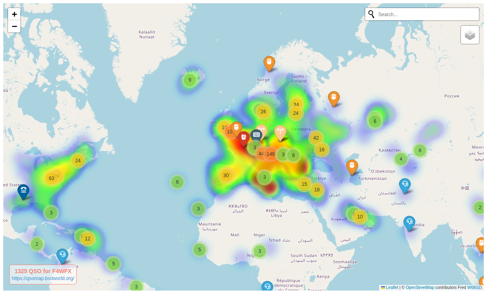

# adif2map

Display your ham radio QSOs on a map.

`adif2map` is a small Python tool that reads an ADIF log file and
generates a map showing the geographic locations of your contacts.

It can be used to get a quick visual overview of where you've made
contacts from your amateur radio log.

## Example:

```
% adif2map -c F4WFX -g JN18lu -o /tmp/F4WFX-map.html -f qlog.adi
2026-10-01 14:02:48,567 - /tmp/load_cty-e4a6a0577479b2b4.pkl
2026-10-01 14:02:48,610 - Cache hit: loaded from /tmp/load_cty-e4a6a0577479b2b4.pkl
2026-10-01 14:02:49,393 - Write file: /tmp/F4WFX-map.html
```

See more examples at https://qsomap.bsdworld.org/ and [/maps][1]



## License

BSD-3-Clause

[1]: https://qsomap.bsdworld.org/maps
